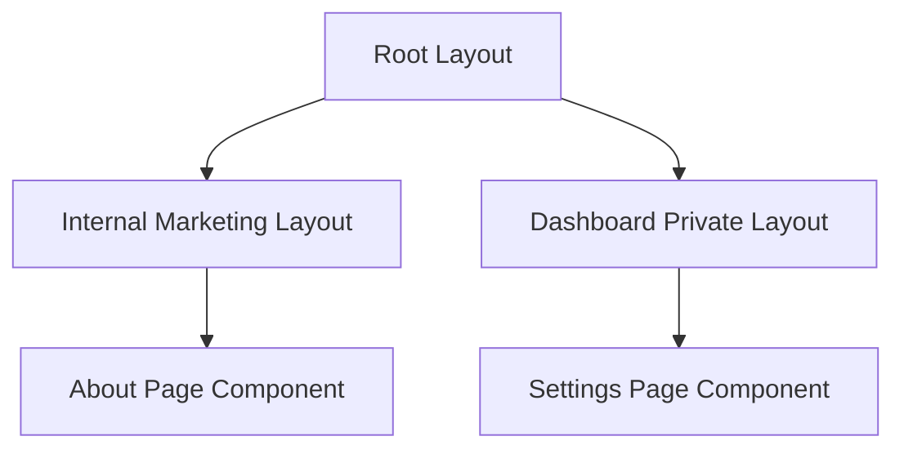

# 🚀 Technical Report: Next.js App Router Architecture

> [!NOTE]
> Tài liệu này cung cấp cái nhìn toàn diện về hệ thống **App Router** trong Next.js 13+, tập trung vào tối ưu hóa hiệu suất thông qua **React Server Components (RSC)** và cơ chế **Streaming**.

---

## 📑 Mục Lục

- [1. Tổng Quan về App Router & Architecture](#1-tổng-quan-về-app-router--architecture)
- [2. File-system Routing & Special Files](#2-file-system-routing--special-files)
- [3. Nested Layouts & Shared UI](#3-nested-layouts--shared-ui)
- [4. Dynamic Routing & Catch-all Segments](#4-dynamic-routing--catch-all-segments)
- [5. Route Groups & Project Organization](#5-route-groups--project-organization)
- [6. Data Fetching, Streaming & Suspense](#6-data-fetching-streaming--suspense)
- [7. Client-side Navigation & Prefetching](#7-client-side-navigation--prefetching)

---

## 1. Tổng Quan về App Router & Architecture

App Router là một kiến trúc định tuyến mới của Next.js, được xây dựng dựa trên **React Server Components (RSC)**, cho phép kết hợp linh hoạt giữa các cơ chế **Server-Side Rendering (SSR)** và **Static Site Generation (SSG)** ở cấp độ Component.

| Feature | Pages Router | App Router |
| :--- | :--- | :--- |
| **Routing Engine** | Based on `pages/` directory | Based on `app/` directory |
| **Component Model** | Mainly Client-side (Hydration) | **React Server Components (RSC)** |
| **Rendering Strategy** | Page-level SSR/SSG | **Component-level** SSR/SSG/ISR |
| **Performance** | High JS Bundle (Initial Load) | Zero Bundle Size for Server Components |

---

## 2. File-system Routing & Special Files

Trong App Router, cấu trúc thư mục đóng vai trò là **Route Segments**. Mỗi Segment được định nghĩa bởi một thư mục và các **Special Files** thực thi các logic cụ thể.

### 🏠 Special Files Quy Ước

- `page.tsx`: 📄 Định nghĩa **Primary UI** cho một Route cụ thể.
- `layout.tsx`: 🏗️ Định nghĩa **Shared UI** (Shared giữa các segments con). Layout không bị **Re-hydrate** khi chuyển đổi route con.
- `loading.tsx`: ⏳ Tự động bọc segment trong một **React Suspense Boundary** để hiển thị Loading State.
- `error.tsx`: ⚠️ Triển khai **React Error Boundary** để xử lý Runtime Errors cục bộ.
- `not-found.tsx`: 🔍 Xử lý logic khi hàm `notFound()` được gọi hoặc route không tồn tại.

---

## 3. Nested Layouts & Shared UI

Hệ thống cho phép lồng các Layouts (Nested Layouts), giúp tái sử dụng UI và giảm thiểu việc render lại các thành phần tĩnh.

> [!TIP]
> **React Server Components** giúp các Layouts được render hoàn toàn trên Server, giảm thiểu khối lượng JavaScript cần thiết cho quá trình **Hydration** ở phía Client.

---

## 4. Dynamic Routing & Catch-all Segments

Next.js hỗ trợ các cơ chế định nghĩa route linh hoạt thông qua **Dynamic Segments**.

- **Dynamic Segment**: `app/blog/[slug]/page.tsx` ➡️ Match `/blog/nextjs-news`
- **Catch-all Segment**: `app/shop/[...slug]/page.tsx` ➡️ Match `/shop/electronics/laptops/apple`
- **Optional Catch-all**: `app/shop/[[...slug]]/page.tsx` ➡️ Match cả `/shop`

> [!IMPORTANT]
> Trong **Next.js 15+**, các thuộc tính `params` và `searchParams` là **Async APIs**. Cần thực hiện `await` để truy cập dữ liệu bên trong.

---

## 5. Route Groups & Project Organization

Sử dụng **Route Groups** (thư mục bọc bởi ngoặc đơn `()`) để tổ chức code theo module, tính năng hoặc phân quyền mà không làm thay đổi cấu trúc của **URL Pathname**.

- `app/(auth)/login/page.tsx` ➡️ `/login`
- `app/(dashboard)/analytics/page.tsx` ➡️ `/analytics`

---

## 6. Data Fetching, Streaming & Suspense

App Router tích hợp sâu với **React Suspense** để cải thiện trải nghiệm người dùng thông qua **Streaming**.

- **Streaming**: Cho phép Server gửi từng phần của trang web (các phần UI đã hoàn thành) về Client mà không cần đợi toàn bộ dữ liệu được tải xong.
- **Suspense Boundaries**: Phân tách các phần UI chậm (ví dụ: lấy dữ liệu từ DB) khỏi các phần UI nhanh (ví dụ: Navigation).

---

## 7. Client-side Navigation & Prefetching

Hệ thống sử dụng cơ chế điều hướng thông minh để tối ưu hóa tốc độ chuyển trang.

### 🔗 Next.js `<Link>` Component

- **Automatic Prefetching**: Khi một `<Link>` xuất hiện trong **Viewport**, Next.js sẽ tự động tải trước mã nguồn và dữ liệu của route đó.
- **Soft Navigation**: Chỉ những phần UI thay đổi mới được render lại, giữ nguyên trạng thái của Shared Layouts.

### 🖱️ Programmatic Navigation (`useRouter`)

- Phải khai báo chỉ thị `"use client"` ở đầu tệp.
- Thường sử dụng trong các **Event Handlers** để thực thi logic trước khi điều hướng.

---

*Verified & Compiled by Antigravity Technical Assistant.*
