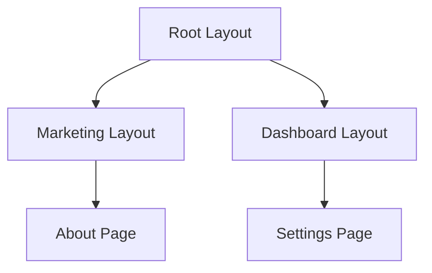

# 🚀 Báo Cáo Chuyên Sâu: Next.js App Router

> [!NOTE]
> Tài liệu này cung cấp cái nhìn toàn diện về hệ thống **App Router** trong Next.js 13+, giúp tối ưu hóa hiệu suất và trải nghiệm nhà phát triển.

---

## 📑 Mục Lục

- [1. Tổng Quan về App Router](#1-tổng-quan-về-app-router)
- [2. Cấu Trúc Thư Mục & File Quy Ước](#2-cấu-trúc-thư-mục--file-quy-ước)
- [3. Nested Layouts (Layout Lồng Nhau)](#3-nested-layouts-layout-lồng-nhau)
- [4. Dynamic Routing (Định Tuyến Động)](#4-dynamic-routing-định-tuyến-động)
- [5. Route Groups (Nhóm Tuyến Đường)](#5-route-groups-nhóm-tuyến-đường)
- [6. Xử Lý Trạng Thái UI (Loading & Error)](#6-xử-lý-trạng-thái-ui-loading--error)
- [7. Điều Hướng (Navigation)](#7-điều-hướng-navigation)

---

## 1. Tổng Quan về App Router

App Router là cuộc cách mạng của Next.js, được xây dựng trên **React Server Components (RSC)**.

| Tính năng | Pages Router | App Router |
| :--- | :--- | :--- |
| **Thư mục gốc** | `pages/` | `app/` |
| **Component mặc định** | Client Components | Server Components |
| **Layouts** | Phức tạp, khó lồng | Đơn giản, mặc định lồng |
| **Hiệu suất** | Tải JS lớn ở Client | Tối ưu hóa Server-rendering |

---

## 2. Cấu Trúc Thư Mục & File Quy Ước

Trong App Router, **thư mục** tạo ra tuyến đường, và các **file đặc biệt** định nghĩa giao diện.

### 🏠 Các File Quy Ước (Special Files)

- `page.tsx`: 📄 Giao diện hiển thị cho người dùng.
- `layout.tsx`: 🏗️ Giao diện dùng chung (Header, Footer, Sidebar).
- `loading.tsx`: ⏳ Hiển thị khi đang tải dữ liệu.
- `error.tsx`: ⚠️ Xử lý lỗi Runtime cục bộ.
- `not-found.tsx`: 🔍 Trang lỗi 404 tùy chỉnh.

---

## 3. Nested Layouts (Layout Lồng Nhau)

Layouts trong thư mục con sẽ lồng vào Layout cha.



> [!TIP]
> Sử dụng `layout.tsx` giúp duy trì trạng thái (state) khi chuyển đổi giữa các trang con mà không cần load lại toàn bộ UI.

---

## 4. Dynamic Routing (Định Tuyến Động)

Sử dụng ngoặc vuông để tạo tham số động.

- `app/blog/[slug]/page.tsx` ➡️ `/blog/hello-world`
- `app/shop/[...slug]/page.tsx` ➡️ `/shop/clothes/men/shoes` (Catch-all)

> [!IMPORTANT]
> Từ **Next.js 15+**, `params` và `searchParams` là các **Promise**. Bạn cần `await` chúng trước khi sử dụng.

```typescript
export default async function Page({ params }: { params: Promise<{ slug: string }> }) {
  const { slug } = await params;
  return <div>Post: {slug}</div>;
}
```

---

## 5. Route Groups (Nhóm Tuyến Đường)

Gom nhóm logic mà không ảnh hưởng đến URL bằng cách dùng dấu ngoặc đơn `()`.

- `app/(auth)/login/page.tsx` ➡️ `/login`
- `app/(auth)/register/page.tsx` ➡️ `/register`

---

## 6. Xử Lý Trạng Thái UI (Loading & Error)

### ⏳ Loading UI

`loading.tsx` sử dụng **React Suspense** để hiển thị giao diện chờ ngay lập tức trong khi chờ Server Component hoàn thành việc lấy dữ liệu.

### ⚠️ Error Handling

`error.tsx` là một **Client Component** dùng để bắt lỗi và hiển thị giao diện thay thế, giúp ứng dụng không bị crash hoàn toàn.

---

## 7. Điều Hướng (Navigation)

### 🔗 Component `<Link>`

Đây là cách điều hướng CHÍNH.

- Tự động **Prefetching**: Tải trước dữ liệu khi link xuất hiện trong tầm nhìn.
- Trải nghiệm SPA mượt mà.

### 🖱️ Hook `useRouter`

Dùng cho các trường hợp xử lý logic trước khi chuyển trang (phải khai báo `"use client"`).

```javascript
"use client"
import { useRouter } from 'next/navigation'

const router = useRouter()
router.push('/dashboard')
```

---

*Báo cáo được thực hiện bởi Antigravity AI.*
